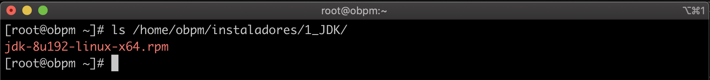
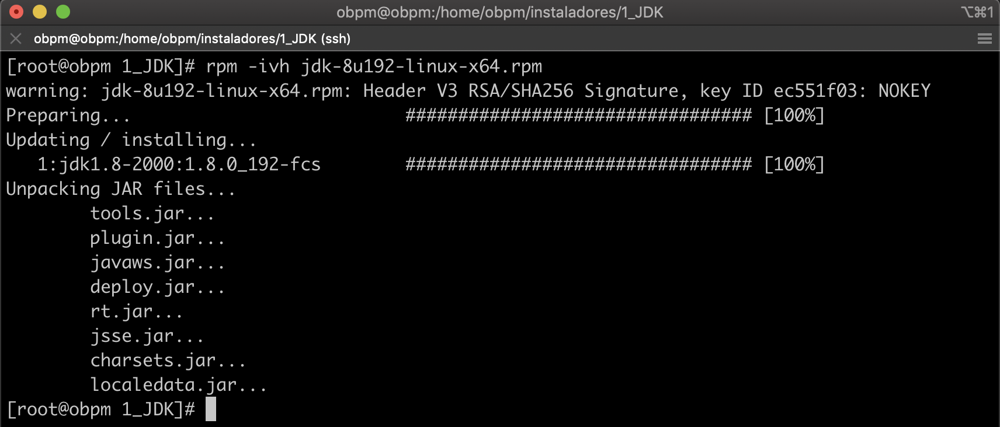
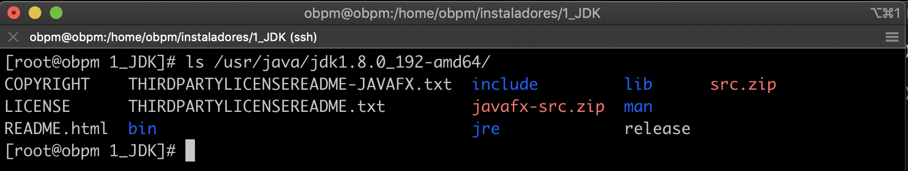
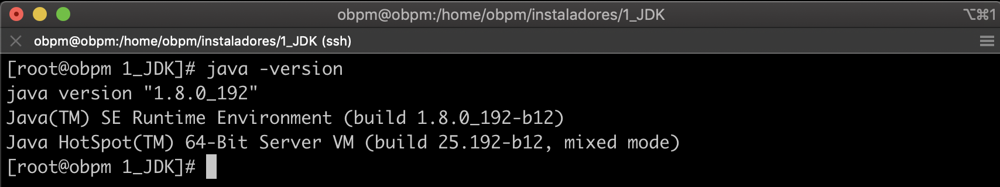

1. Nos ubicamos en la ruta donde se encuentra el archivo de instalación, en mi caso se encuentra en la ruta */home/obpm/instaladores/1_JDK* 

    

2. Ejecutamos el siguiente comando para dar inicio con la instalación.

        # rpm -ivh jdk-8u192-linux-x64.rpm

    

3. Verificamos que se haya instalado los archivos del *jdk* en la ruta */usr/java/jdk1.8.0_271-amd64/*.

        # ls /usr/java/jdk1.8.0_192-amd64/

    

4. Verificamos que el *jdk* fue instalado correctamente.

        # java -version

    

    

