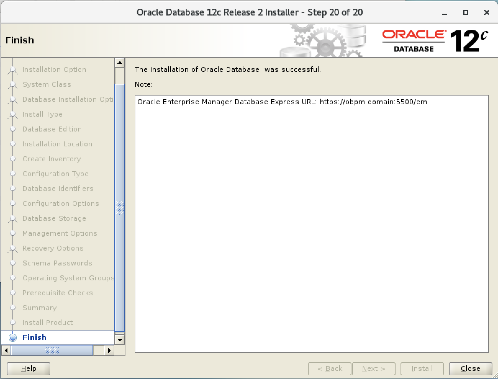

Antes de comenzar con la instalación de la Base de Datos Oracle, debemos configurar algunos archivos del Sistema Operativo (Centos 7). Cabe destacar que todas estas configuraciones se tienen que realizar como usuario *root*.

### Configuración de los Parámetros del Kernel

+ Editamos el archivo **sysctl.conf**.

        # vim /etc/sysctl.conf

    

+ Pegamos las siguientes líneas en el archivo **sysctl.conf**.

        net.ipv4.conf.default.rp_filter = 1
        net.ipv4.conf.default.accept_source_route = 0
        kernel.sysrq = 0
        kernel.core_uses_pid = 1
        net.ipv4.tcp_syncookies = 1
        kernel.msgmnb = 65536
        kernel.msgmax = 65536
        kernel.shmmax = 68719476736
        kernel.shmall = 4294967296
        fs.file-max = 6815744
        kernel.sem = 250 32000 100 128
        kernel.shmmni = 4096
        kernel.shmall = 1073741824
        kernel.shmmax = 4398046511104
        net.core.rmem_default = 262144
        net.core.rmem_max=4194304
        net.core.wmem_default=262144
        net.core.wmem_max=1048576
        fs.aio-max-nr = 1048576
        net.ipv4.ip_local_port_range = 9000 65000

    

+ En la raíz del directorio */*, ejecutamos el comando *sbin/sysctl -p*.

        # cd /
        # sbin/sysctl -p

    

### Configuración de Seguridad

+ Editamos el archivo **limits.conf**.

        # vim /etc/security/limits.conf

    

+ Pegamos las siguientes lineas en el archivo **limits.conf**.

        obpm  soft  nofile  1024
        obpm  hard  nofile  65536
        obpm  soft  nproc   16384
        obpm  hard  nproc   65536
        obpm  soft  stack   10240

    

### Instalación de Paquetes necesarios

+ Instalamos los siguientes paquetes.

        # yum install compat-libcap1-1.10
        # yum install libstdc++-devel
        # yum install gcc-c++
        # yum install ksh
        # yum install glibc-devel
        # yum install libaio-devel

### Hostname

+ Modificamos el nombre del Host, para ello editamos el archivo *hosts*.

        # vim /etc/hosts

    

+ Verificamos la IP del servidor, y le damos el nombre de dominio que creamos conveniente, en nuestro caso la IP es *192.168.28.135* y el HOST_NAME es *obpm.domain*.

        192.168.28.135  obpm.domain     obpm

    

### Instalación Oracle Data Base

1. Nos deslogeamos como *root* y nos logeamos con el usuario que deseamos instalar, en nuestro caso el usuario se llama *obpm*.

        # su obpm
    
    

2. Iniciamos con la instalación, abrimos la carpeta donde se encuentra el instalador de la base de datos, en nuestro caso la ruta es *home/obpm/instaladores/2_ODB/database/*.

        # cd home/obpm/instaladores/2_ODB/database/
        # ls

    

3. Ejecutamos el archivo *./runInstaller*.

        # ./runInstaller

    

4. Se presenta la primera ventana de la Instalación **Configure Security Updates**

    

5. Deseleccionar **I wish to receive security updates via My Oracle Support**, click en **Next**.

    

6. Click en **Yes**. 

    

7. Seleccionar **Create and configure a database**, click en **Next**.  

    

8. Seleccionar **Server class**, click en **Next**. 

    

9. Seleccionar **Single instance database installation**, click en **Next**.  

    

10. Seleccionar **Advanced install**, click en **Next**. 

    

11. Seleccionar **Enterprise Edition (7.5GB)**, click en **Next**.

    

12. Modificamos la ruta **Oracle base**, en nuestro caso la ruta por defecto es */home/obpm/app/obpm*, la modificaremos por la ruta  */opt/obpm/app/obpm*.

    

13. Tenemos la misma ventana con la ruta modificada, click en **Next**. 

    

14. Click en **Next**.

    

15. Seleccionar **General Purpose**, click en **Next**.  

    

16. Por defecto el valor de **Global databa name** viene con *orcl*, en nuestro caso modificaremos este nombre, lo cambiaremos por *obpmdb*. Deseleccionar **Create as Container database**, click en **Next**. 

    

17. Seleccionamos la pestaña **Character sets** y tambien seleccionamos **User Unicode (AL32UTF8)**, click en **Next**. 

    

18. Click en **Next**.

    

19. Click en **Next**. 

    

20. Click en **Next**. 

    

21. Seleccionar **Use the same password for all accounts**, Ingrese un password (en nuestro ejemplo: *ObpmDB2020*), click en **Next**.

    

22. Click en **Next**.

    

23. Click en **Install**.

    

24. Se da inicio a la instalación de la base de datos Oracle.

    

25. En medio de esta instalación se presenta la siguiente ventana.

    

26. Abrimos una terminal y nos logueamos como usuario *root*, ejecutamos los 2 archivos *.sh* que se visualizan en la grafica.

        # /opt/obpm/app/oraInventory/orainstRoot.sh

    

        # /opt/obpm/app/obpm/product/12.2.0/dbhome_1/root.sh

    

27. Una ves ejecutado los shell scripts que Oracle nos recomienda, damos click en **OK**. Esperamos unos minutos mientras, puedes ir por un café 😉.

    

28. Una vez culminada la instalación aparecerá la siguiente ventana, click en **Close**.  

    

## Verificación

Abrimos un navegador y colocamos la url **https://obpm.domain:5500/em**, si todo esta correctamente instalado deberán tener una imagen similar a la que se presenta en la gráfica.

   

    

