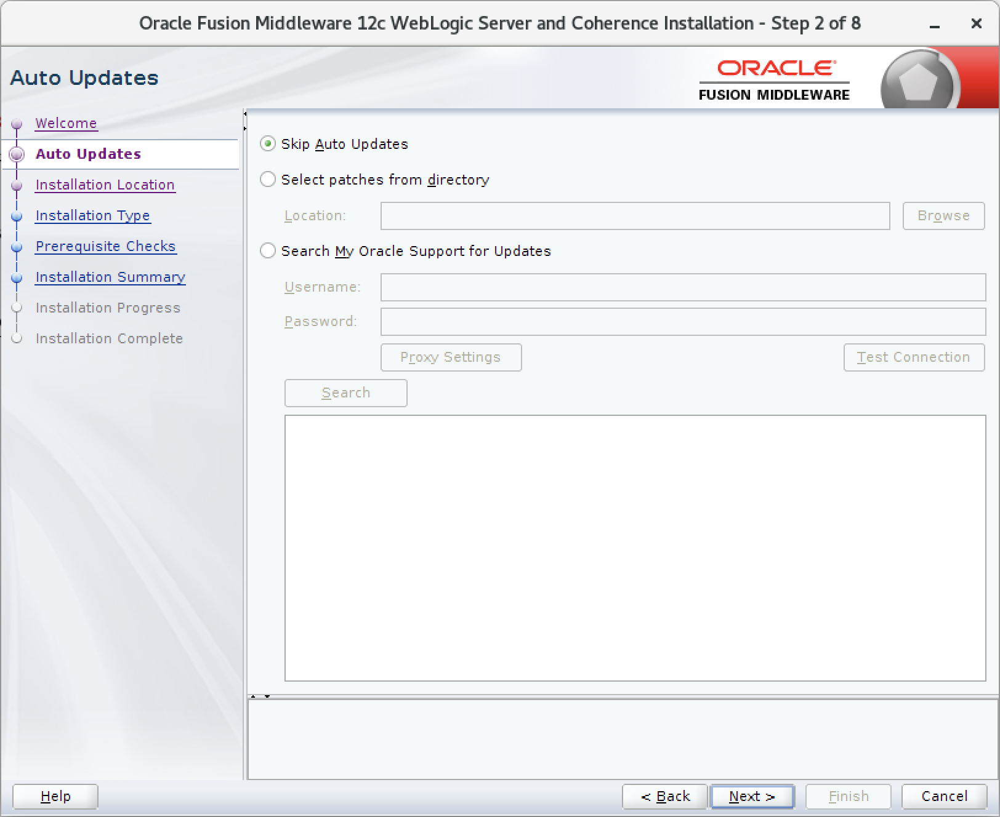
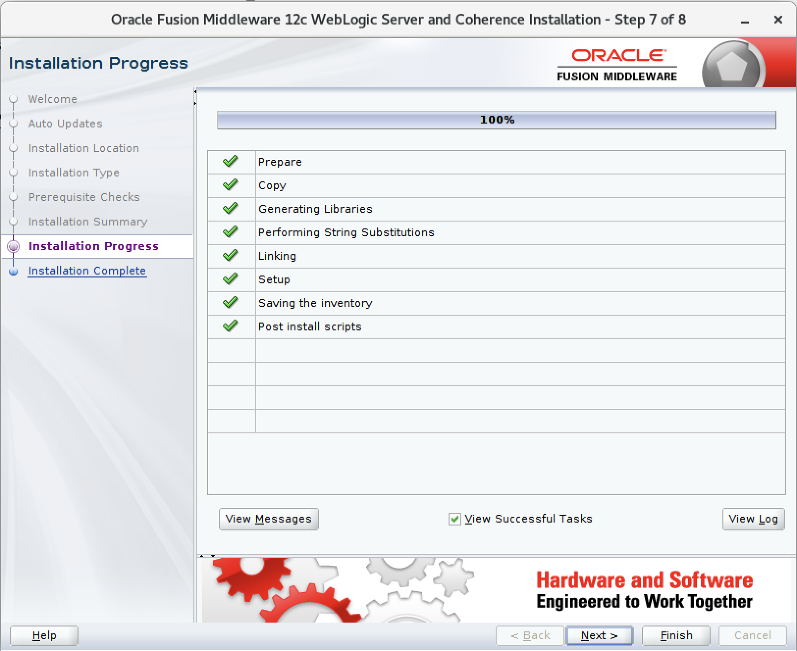

1. Nos deslogeamos como *root* y nos logeamos con el usuario que deseamos instalar, en mi caso el usario se llama *obpm*.

    

2. Abrimos una terminal y nos ubicamos en la ruta donde se encuentran los instaladores, en nuestro caso lo tenemos en */home/obpm/instaladores/3_WEBLOGIC*.

        # ls /home/obpm/instaladores/3_WEBLOGIC/

    

3. Ejecutamos el archivo **fmw_12.2.1.3.0_wls.jar**

        # java -jar fmw_12.2.1.3.0_wls.jar
    
    

4. Se muestra la siguiente ventana que da inicio de la instalación. 

    

5. Click en **Next**.    

    

6. Click en **Next**.    

    

7. En **Oracle Home** colocamos la siguiente ruta */opt/obpm/Oracle/Middleware/Oracle_Home*, click en **Next**.

    

8. Seleccionamos **WebLogic Server**, click en **Next**.  

    

9. Click en **Next**.

    

10. Click en **Install**.  

    

11. Click en **Next**.

    

12. Deseleccionar **Automatically Launch the Configuration Wizard** y click en **Finish**.

    

    

