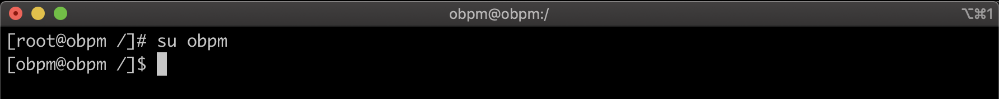
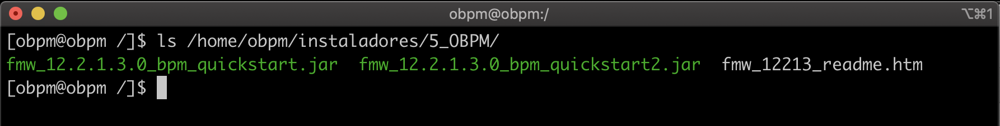

1. Nos deslogeamos como *root* y nos logeamos con el usuario que deseamos instalar, en nuestro caso el usuario se llama *obpm*.

        # su obpm

    

2. Abrimos una terminal y nos ubicamos en la ruta donde se encuentran los instaladores, en nuestro caso lo tenemos en */home/obpm/instaladores/4_SOA*.

        # ls /home/obpm/instaladores/5_OBPM

    

3. Ejecutamos el archivo **fmw_12.2.1.3.0_bpm_quickstart.jar**

        # java -jar fmw_12.2.1.3.0_bpm_quickstart.jar

    

4. Click en **Next**.

    

5. Click en **Next**.

    

6. En **Oracle Home** seleccionamos */opt/obpm/Oracle/Middleware/Oracle_Home*, click en **Next**.

    

7. Click en **Next**.

    

8. Click en **Install**.

    

9. Click en **Next**.

    

10. Deseleccionar **Start JDeveloper** y click en **Finish**.

    

    

