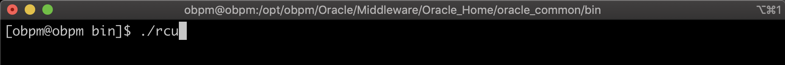
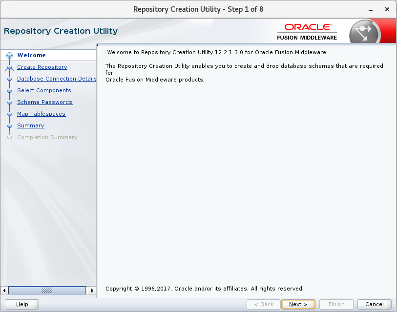
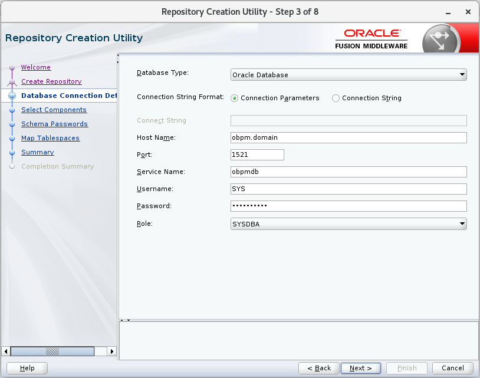
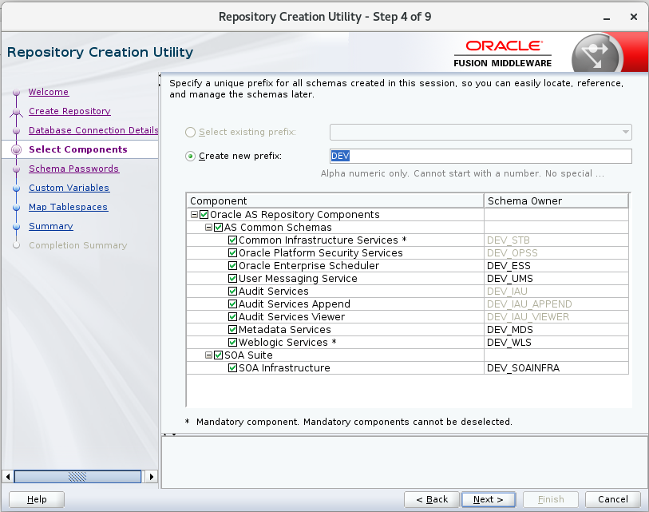

1. Nos deslogeamos como *root* y nos logeamos con el usuario que deseamos instalar, en nuestro caso el usuario se llama *obpm*.

        # su obpm

    

2. Abrimos una Terminal y vamos a la ruta: **/opt/obpm/Oracle/Middleware/Oracle_Home/oracle_common/bin**.

        # cd /opt/obpm/Oracle/Middleware/Oracle_Home/oracle_common/bin

    

3. Ejecutamos el archivo **rcu**.

        # ./rcu

    

4. Se abre la siguiente ventana, click en **Next**. 

    

5. Seleccionamos **System Load and Product Load**, click en **Next**. 

    

6. Llenamos la información solicitada en base a la configuración de la Base de Datos, click en **Next**.

    |  NOMBRE          |  VALOR      |
    | ---------------- | ----------- |
    | **Hostname**     | obpm.domain |
    | **Port**         | 1521        |
    | **Service Name** | obpmdb      |
    | **Username**     | SYS         |
    | **Password**     | ObpmDB2020  |
    | **Role**         | SYSDBA      |

    

7. Verificamos que todos lo Prerrequisitos este con visto verde, click en **OK**.      

    

8. Seleccionamos **Oracle AS Repository Components**, click en **Next**.   

    

9. Verificamos que todos lo Prerrequisitos este con visto verde, click en **OK**.   

    

10. Definimos un password para los esquemas que se van a crear, en nuestro caso definimos un mismo password para todos los esquemas, recuerde que usted puede especificar un password para cada uno de estos esquemas, click en **Next**.

    **Password:** obpm2020

    

11. Click en **Next**.  

    

12. Click en **Next**. 

    

13. Click en **OK**.  

    

14. Verificamos que todos lo Prerrequisitos este con visto verde, click en **OK**.

    

15. Click en **Create**.  

    

16. Verificamos que la creación de todos los esquemas se realizo correctamente, click en **Close**.

    

    

