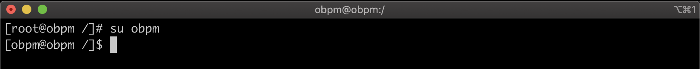
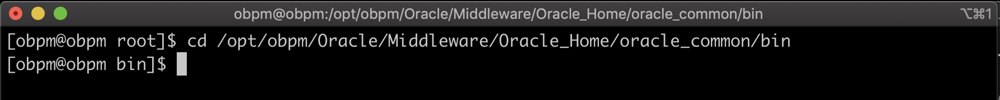
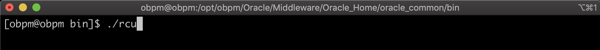
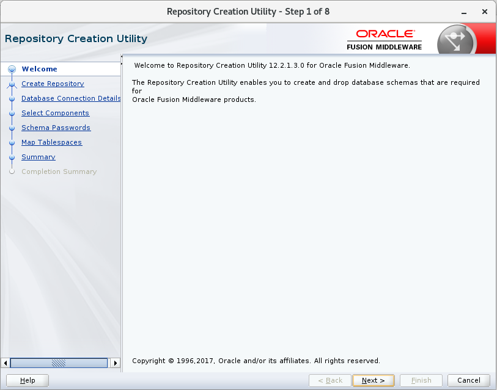
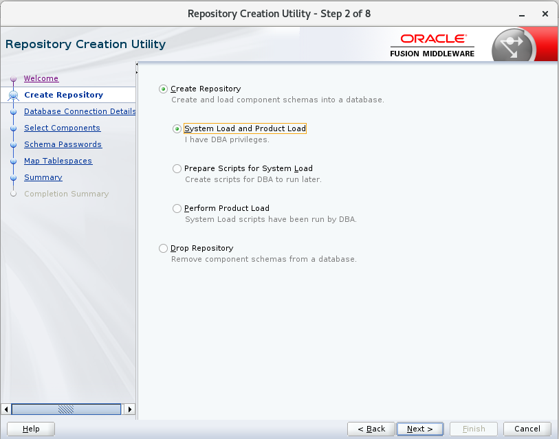
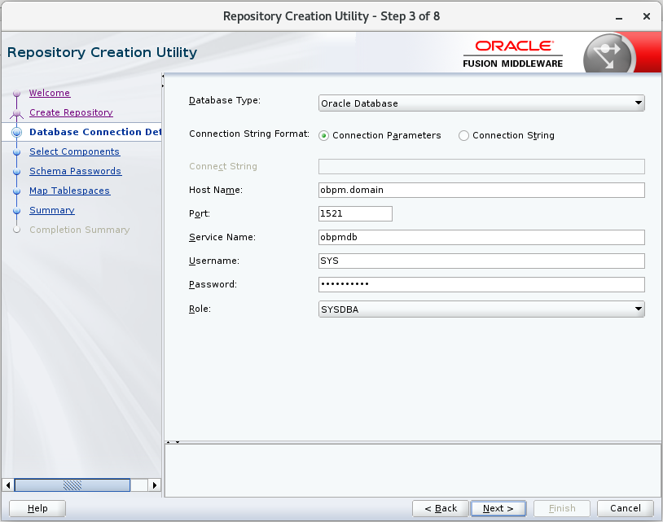
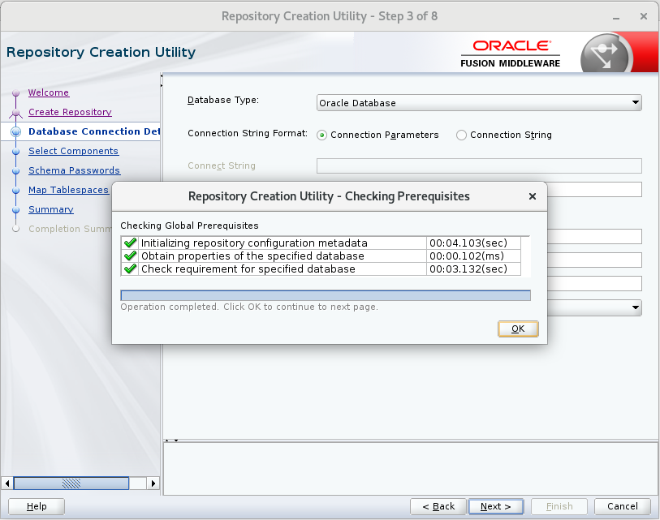

1. Nos deslogeamos como *root* y nos logeamos con el usuario que deseamos instalar, en mi caso el usuario se llama *obpm*.

        # su obpm

    

2. Abrimos una Terminal y vamos a la ruta: **/opt/obpm/Oracle/Middleware/Oracle_Home/oracle_common/bin**.

        # cd /opt/obpm/Oracle/Middleware/Oracle_Home/oracle_common/bin

    

3. Ejecutamos el archivo **rcu**.

        # ./rcu

    

4. Se abre la siguiente ventana, click en **Next**. 

    

5. Seleccionamos **System Load and Product Load**, click en **Next**. 

    

6. Llenamos la información solicitada en base a la configuración de la Base de Datos, click en **Next**.

    |  NOMBRE          |  VALOR      |
    | ---------------- | ----------- |
    | **Hostname**     | obpm.domain |
    | **Port**         | 1521        |
    | **Service Name** | obpmdb      |
    | **Username**     | SYS         |
    | **Password**     | ObpmDB2020  |
    | **Role**         | SYSDBA      |

    

7. Verificamos que todos lo Prerrequisitos este con visto verde, click en **OK**.      

    

    

