1. Nos deslogeamos como *root* y nos logeamos con el usuario que deseamos instalar, en mi caso el usuario se llama *obpm*.

        # su obpm

    

2. Abrimos una Terminal y vamos a la ruta: **/opt/obpm/Oracle/Middleware/Oracle_Home/oracle_common/common/bin**

    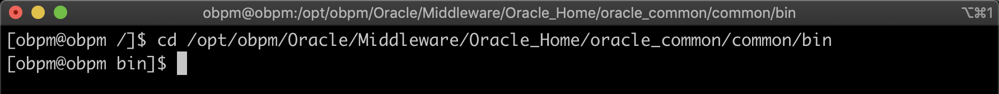

3. Ejecutamos el archivo **config.sh**.

    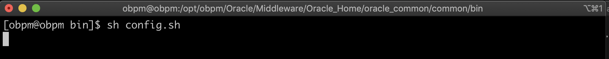

4. Se abre el Asistente de Configuración del Dominio.

    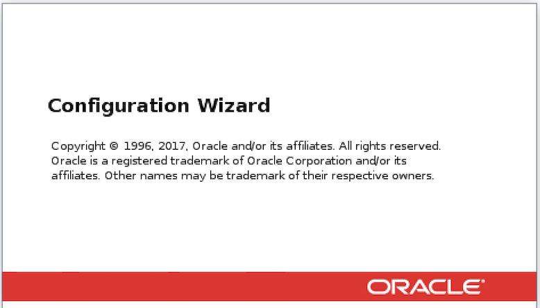

5. Seleccionamos **Create a new domain** y en **Domain Location** colocamos la ruta sugerida por el wizard */opt/obpm/Oracle/Middleware/Oracle_Home/user_projects/domains/base_domain*, click en **Next**.

    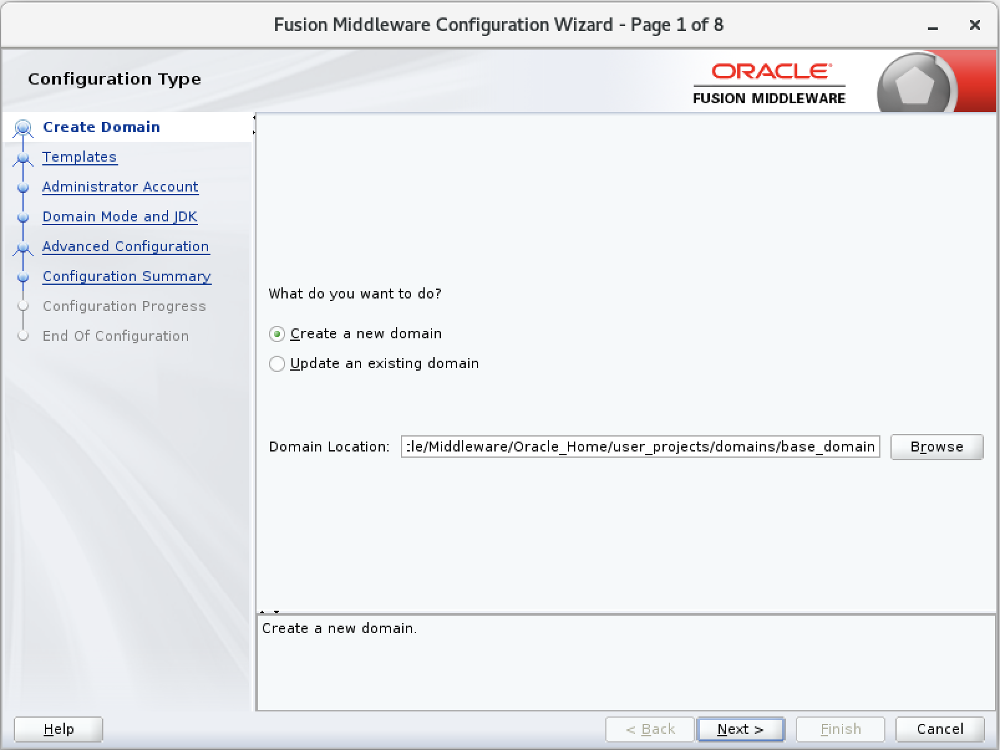

6. Seleccionamos **Create Domain Using Product Templates** y de la lista de templetas se suguiere seleccionar:
    + Oracle BPM Suite - 12.2.1.3.0 [soa]
    + Oracle Business Activity Monitoring - 12.2.1.3.0 [soa]
    + Oracle SOA Suite - 12.2.1.3.0 [soa]
    + Oracle Enterprise Manager Suite - 12.2.1.3.0 [em]
    + Oracle JRF - 12.2.1.3.0 [oracle_common]
    + Oracle WSM Policy Manager - 12.2.1.3.0 [oracle_common]
    + Weblogic Coherence Cluster Extension - 12.2.1.3.0 [wlserver]

    Click en **Next**.    

    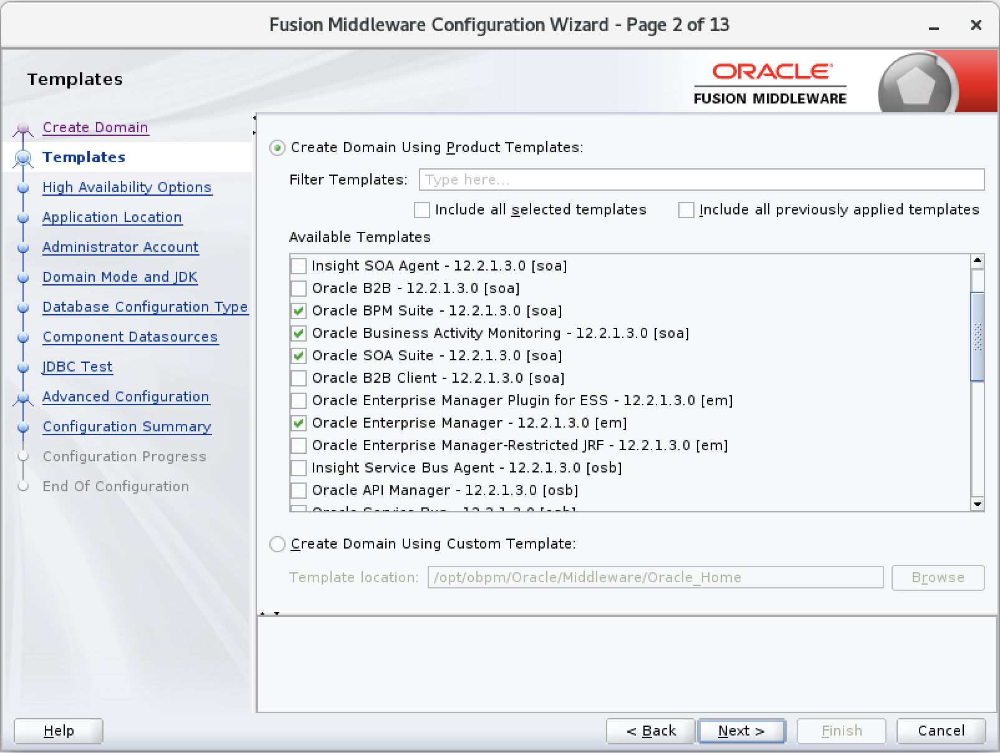

7. Click en **Next**.

    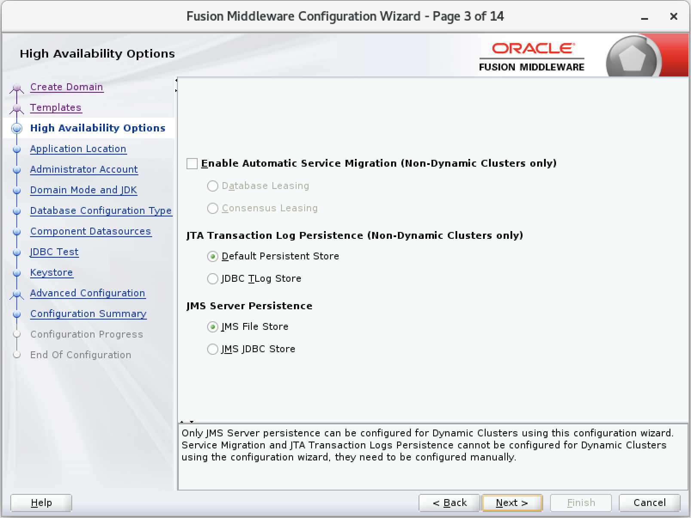

8. En **Application location** colocamos la ruta sugerida por el wizard */opt/obpm/Oracle/Middleware/Oracle_Home/user_projects/applications/base_domain*, click en **Next**.

    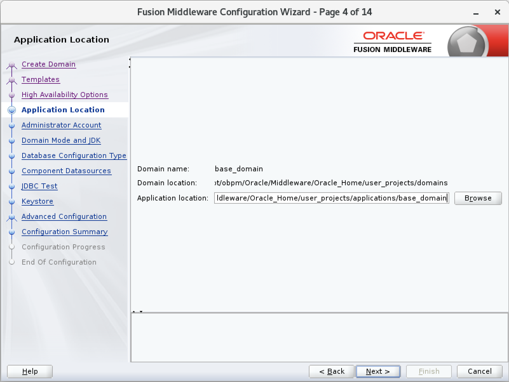

9. Llenamos los valores solicitados **Name:** *weblogic* y **Password** *welcome01*, click en **Next**.

    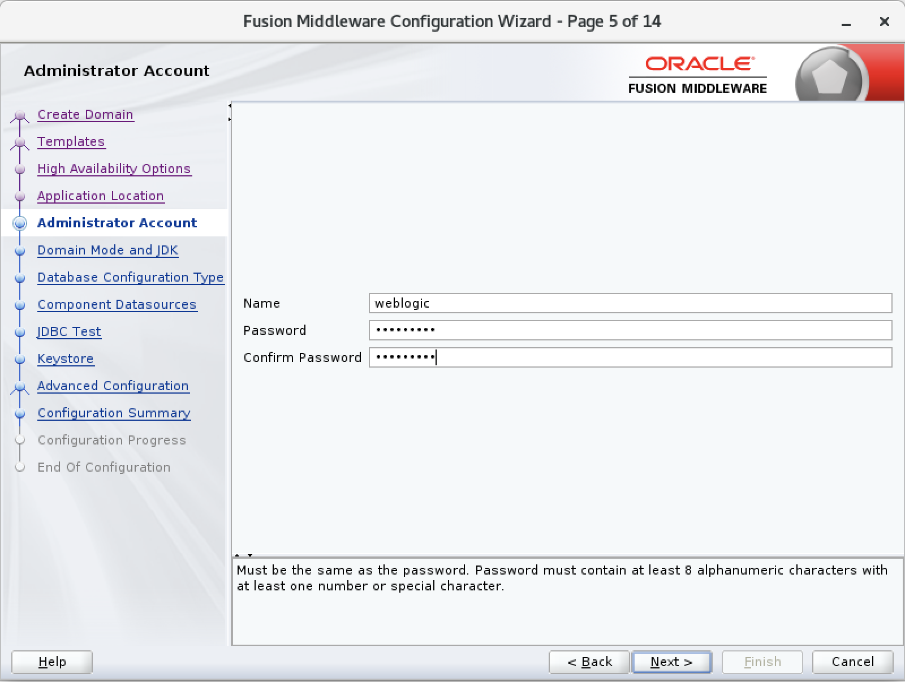

10. En **Domain Mode** seleccionamos **Development** y en **JDK** seleccionamos **Oracle HostSpot 1.8.0_192**, click en Next.

    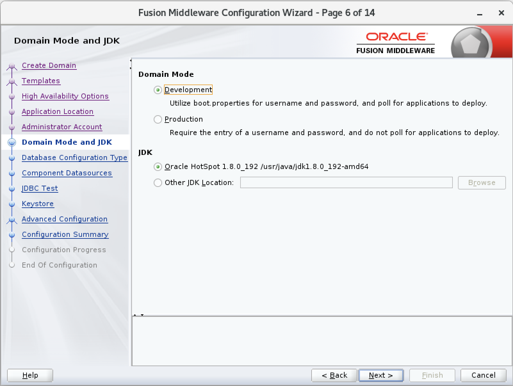

11. Llenamos los parametros de conexión que el wizard nos solicita:

    |  NOMBRE             |  VALOR      |
    | ------------------- | ----------- |
    | **Vendor**          | Oracle      |
    | **Driver**          | Oracle's Driver (Thin) for Service connections; ... |
    | **Host Name**       | obpm.domain |
    | **DBMS/Service**    | obpmdb      |
    | **Port**            | 1521        |
    | **Schema Owner**    | DEV_STB     |
    | **Schema Password** | obpm2020  |

    Click en **Get RCU Configuration**.

    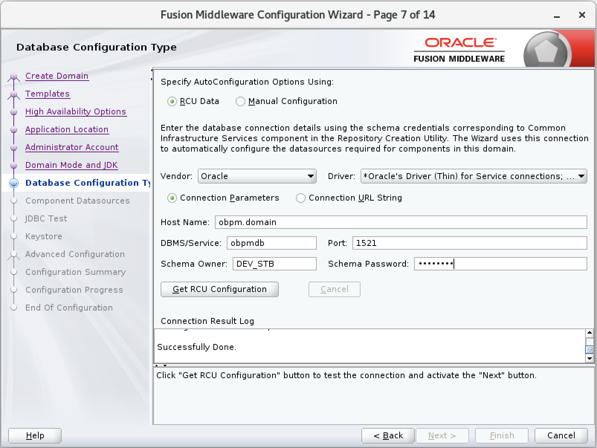

12. Si todo esta correcto deberiamos tener una ventana similar a la siguiente, click en **Next**.

    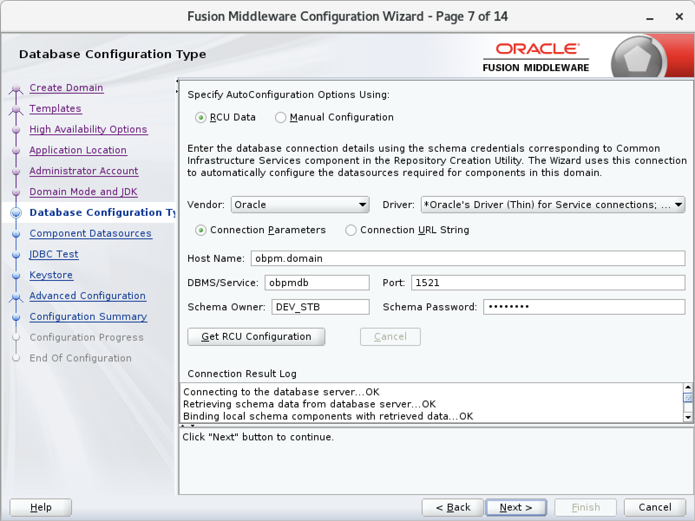

13. Click en **Next**. 

    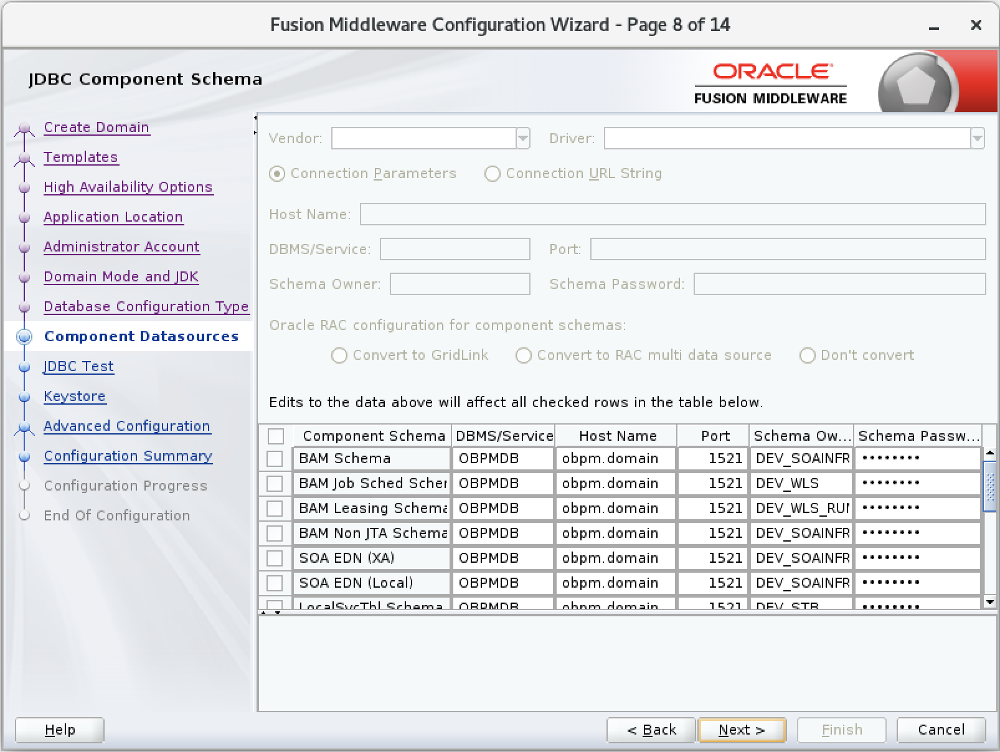

14. Si todo esta correcto deberiamos tener una ventana similar a la siguiente, click en **Next**. 

    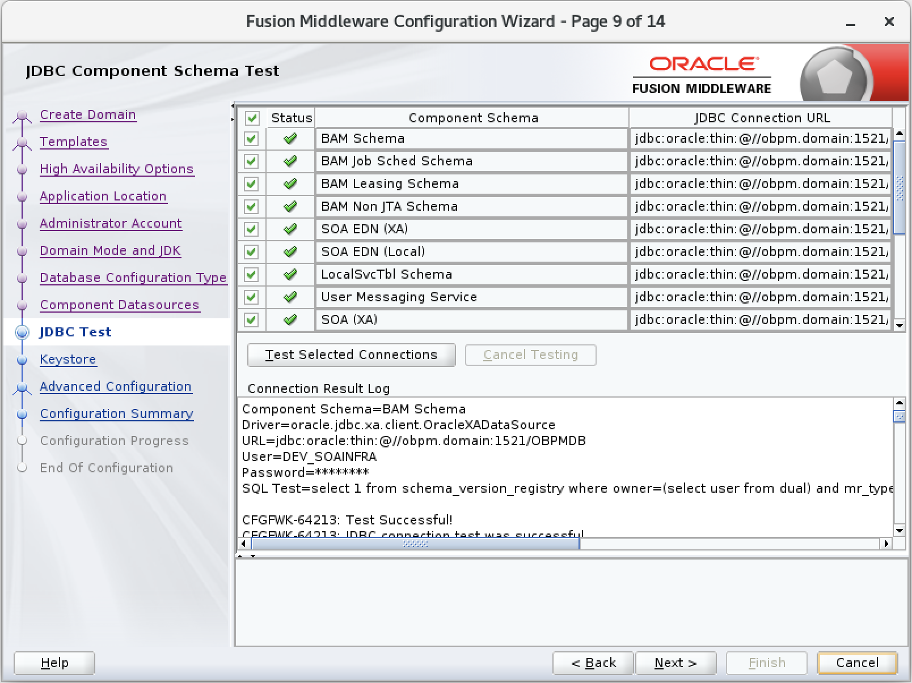

    

