Nos logeamos con el usuario que hicimos la instalación, en nuestro caso el usuario es *obpm*.

    # su obpm

## START WEBLOGIC SERVER

+ Nos dirigimos a la ruta donde instalamos el dominio, en nuestro caso es */opt/obpm/Oracle/Middleware/Oracle_Home/user_projects/domains/base_domain*.

        # cd /opt/obpm/Oracle/Middleware/Oracle_Home/user_projects/domains/base_domain

    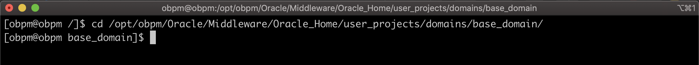

+ Ejecutamos el siguiente comando.

        # ./startWebLogic.sh

    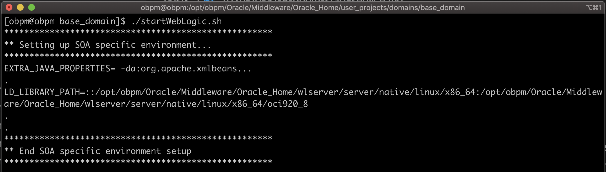

+ Si el servidor subió correctamente, deberíamos tener un mensaje en la terminal similar a la siguiente imagen.

    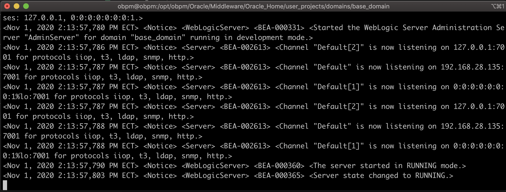

+ Abrimos un navegador en nuestro caso usaremos Chrome y colocamos la siguiente url: **http://obpm.domain:7001/console/**.

    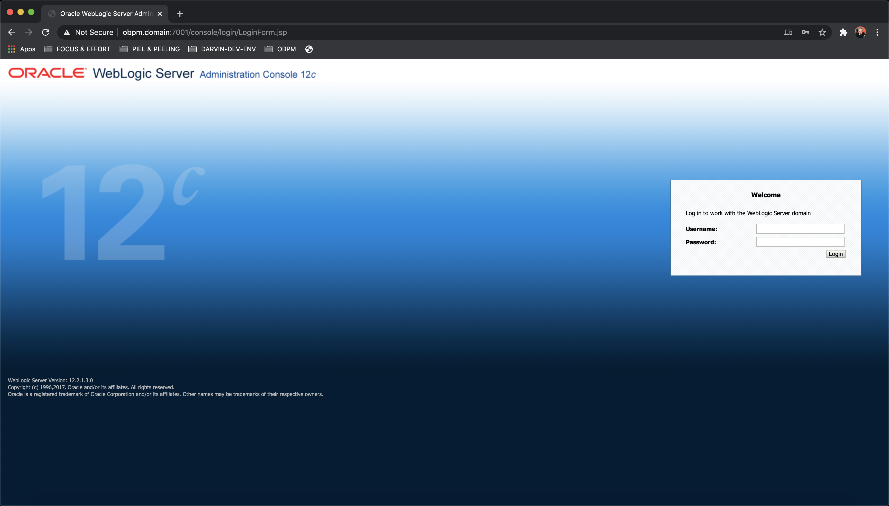

+ Nos logueamos con el usuario *weblogic*, recordar que este es el usuario administrador que configuramos al momento de instalar el dominio.

    | **usuario** | **password** |
    | ----------- | ------------ |
    | weblogic    | welcome01    |

    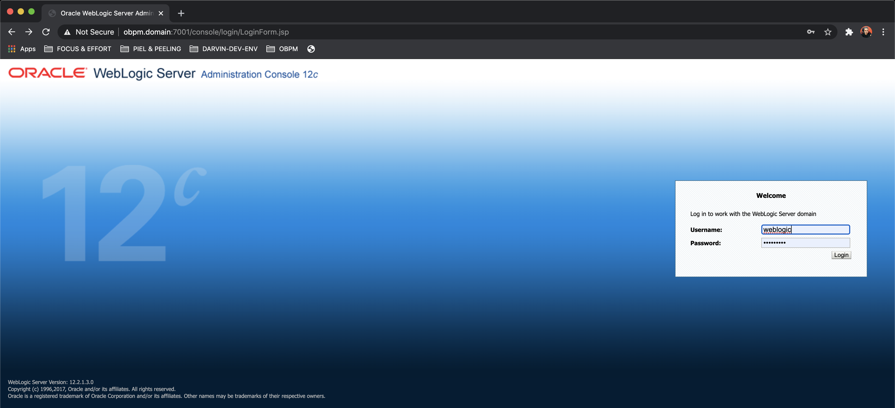

    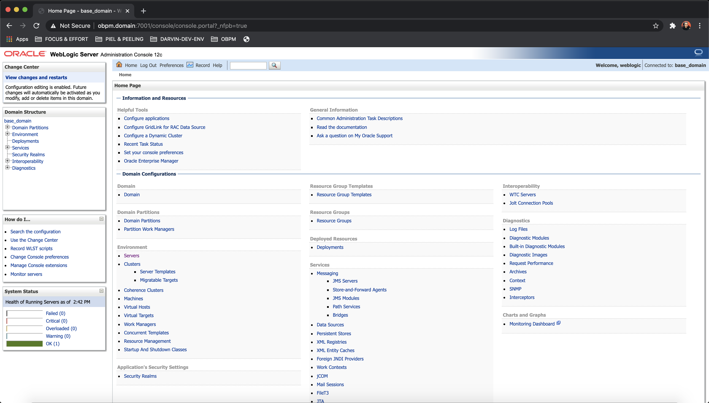

+ Podemos visualizar los servidores que estan a disposición para ser usados, para ello nos dirigimos en el menú lateral y seleccionamos **Enviroemnt/Servers**. Se presentara una ventana en la que podemos visualizar información de los tres servidores [AdminServer(admin), bam_server1, soa_server1] que podemos usar como el nombre, el estado y el puerto de los mismos.

    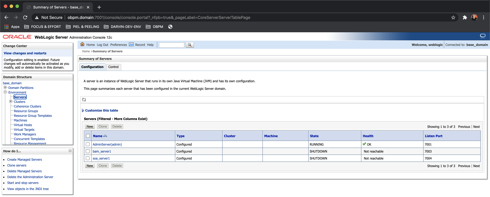

## START BAM SERVER

+ Nos dirigimos a la ruta donde instalamos el dominio, en nuestro caso es */opt/obpm/Oracle/Middleware/Oracle_Home/user_projects/domains/base_domain/bin/*.

        # cd /opt/obpm/Oracle/Middleware/Oracle_Home/user_projects/domains/base_domain/bin/
    
    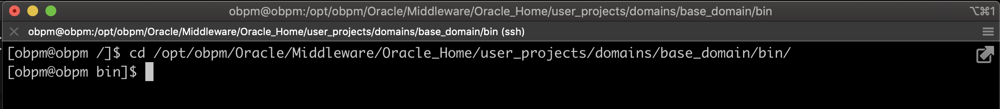

+ Ejecutamos el siguiente comando.

        # ./startManagedWebLogic.sh bam_server1

    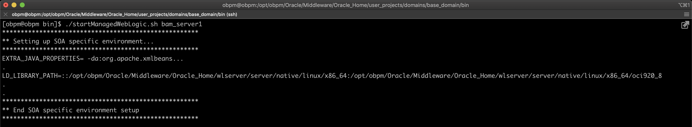

+ Se nos solicitara un usuario y password administrador de weblogic, proporcionamos estos valores y esperamos que suba el servidor.

    | **usuario** | **password** |
    | ----------- | ------------ |
    | weblogic    | welcome01    |

    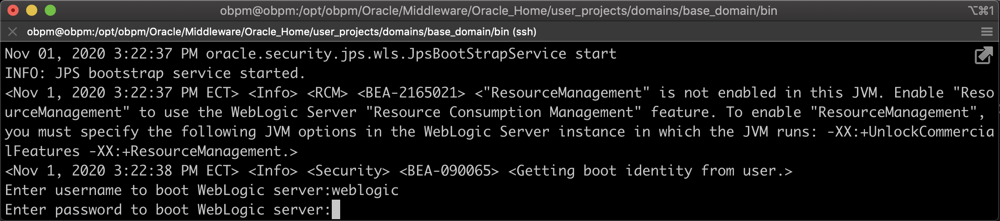

+ Para validar si el usuario subió correctamente podemos ir a la consola de administración de Weblogic **http://obpm.domain:7001/console/** y en **Enviroemnt/Servers** visualizar el estado del *bam_server1*.

    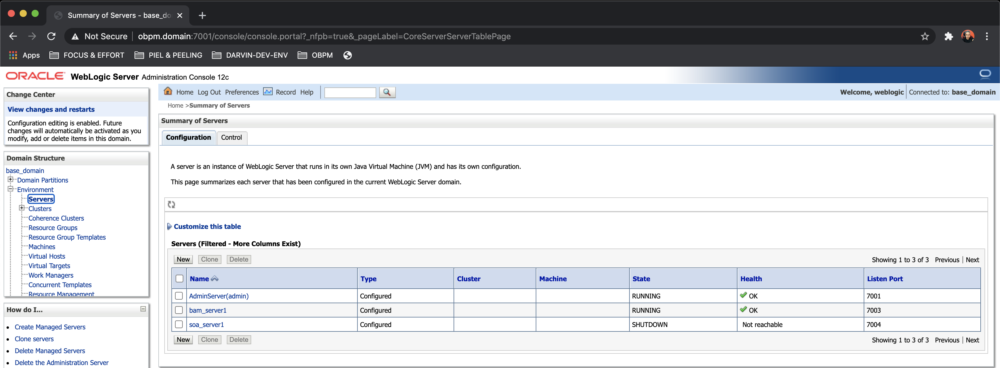

## START SOA SERVER

    

