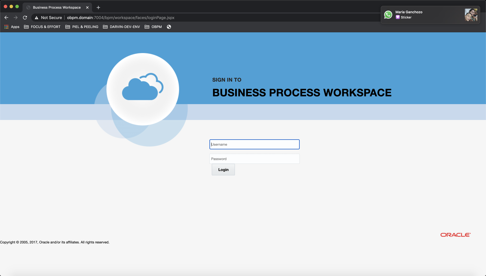

Se presenta una lista de productos que tiene a disposición una ves que haya culminado con la instalación de Oracle BPM. Usted puede acceder a cada una de ellas con el usuario y password que uso al configurar el dominio, en nuestro caso es:

| **usuario** | **password** |
| ----------- | ------------ |
| weblogic    | welcome01    |

## WebLogic Server Admin Console

+ http://obpm.domain:7001/console

## EM Control

+ http://obpm.domain:7001/em

## SOA Composer

+ http://obpm.domain:7004/soa/composer/

## SOA Infrastructure

+ http://obpm.domain:7004/soa-infra/

## BPM Composer

+ http://obpm.domain:7004/bpm/composer

## BPM Worklist

+ http://obpm.domain:7004/integration/worklistapp

## BPM Workspace

+ http://obpm.domain:7004/bpm/workspace

## User Messaging Preference UI

+ http://obpm.domain:7004/sdpmessaging/userprefs-ui

## WSM Policy Manager Validation

+ http://obpm.domain:7004/wsm-pm/

    

