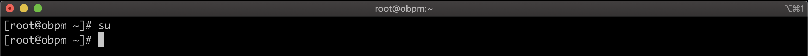

El presente documento pretende servir de guía para dar inicio a la instalación de un ambiente de desarrollo de **Oracle Business Process Management Standard Edition** en Centos 7.

## REQUISITOS

Antes de dar inicio a la instalación, por favor **descargue** las siguientes herramientas.

+ [JDK Download](https://www.oracle.com/java/technologies/javase/javase7-archive-downloads.html)
+ [ORACLE-DB Download](https://www.oracle.com/database/technologies/oracle-database-software-downloads.html)
+ [OBPM Download](https://edelivery.oracle.com/osdc/faces/Home.jspx)

1.  Nos logueamos con el usuario *root*.

        # su

    

2.  Actualizamos todos los paquetes de Centos 7.

        # yum update

    

3.  Instalamos Unzip

        # yum install unzip

    

4.  Cambiamos y asignamos los permisos necesarios a la carpeta **/opt**, ya que en esta ruta estarán todos los directorios y ficheros de toda la instalación.

        # chmod -R 777 /opt/
        # chown obpm /opt/

    

## INSTALACIÓN

Se presenta la lista de herramientas que se requiere para completar la instalación de Oracle BPM 12c, el orden de instalación que se presenta en este manual no es algo que se deba seguir al pie de la letra, en caso de no tener previos conocimientos de la herramienta se sugiere seguir estos pasos.

[Link to another page](another-page).

There should be whitespace between paragraphs.

There should be whitespace between paragraphs. We recommend including a README, or a file with information about your project.

# [](#header-1)Header 1

This is a normal paragraph following a header. GitHub is a code hosting platform for version control and collaboration. It lets you and others work together on projects from anywhere.

## [](#header-2)Header 2

> This is a blockquote following a header.
>
> When something is important enough, you do it even if the odds are not in your favor.

### [](#header-3)Header 3

```js
// Javascript code with syntax highlighting.
var fun = function lang(l) {
  dateformat.i18n = require('./lang/' + l)
  return true;
}
```

```ruby
# Ruby code with syntax highlighting
GitHubPages::Dependencies.gems.each do |gem, version|
  s.add_dependency(gem, "= #{version}")
end
```

#### [](#header-4)Header 4

*   This is an unordered list following a header.
*   This is an unordered list following a header.
*   This is an unordered list following a header.

##### [](#header-5)Header 5

1.  This is an ordered list following a header.
2.  This is an ordered list following a header.
3.  This is an ordered list following a header.

###### [](#header-6)Header 6

| head1        | head two          | three |
|:-------------|:------------------|:------|
| ok           | good swedish fish | nice  |
| out of stock | good and plenty   | nice  |
| ok           | good `oreos`      | hmm   |
| ok           | good `zoute` drop | yumm  |

### There's a horizontal rule below this.

* * *

### Here is an unordered list:

*   Item foo
*   Item bar
*   Item baz
*   Item zip

### And an ordered list:

1.  Item one
1.  Item two
1.  Item three
1.  Item four

### And a nested list:

- level 1 item
  - level 2 item
  - level 2 item
    - level 3 item
    - level 3 item
- level 1 item
  - level 2 item
  - level 2 item
  - level 2 item
- level 1 item
  - level 2 item
  - level 2 item
- level 1 item

### Small image


### Large image


### Definition lists can be used with HTML syntax.

<dl>
<dt>Name</dt>
<dd>Godzilla</dd>
<dt>Born</dt>
<dd>1952</dd>
<dt>Birthplace</dt>
<dd>Japan</dd>
<dt>Color</dt>
<dd>Green</dd>
</dl>

```
Long, single-line code blocks should not wrap. They should horizontally scroll if they are too long. This line should be long enough to demonstrate this.
```

```
The final element.
```
