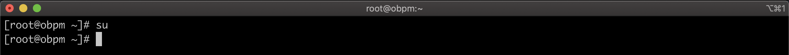
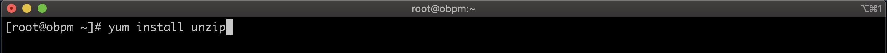
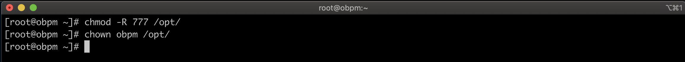

El presente documento pretende servir de guía para dar inicio a la instalación de un ambiente de desarrollo de **Oracle Business Process Management Standard Edition** en Centos 7.

## REQUISITOS

Antes de dar inicio a la instalación, por favor **descargue** los respectivos instaladores.

+ [JDK Download](https://www.oracle.com/java/technologies/javase/javase7-archive-downloads.html)
+ [ORACLE-DB Download](https://www.oracle.com/database/technologies/oracle-database-software-downloads.html)
+ [OBPM Download](https://edelivery.oracle.com/osdc/faces/Home.jspx)

1.  Nos logueamos con el usuario *root*.

        # su

    

2.  Actualizamos todos los paquetes de Centos 7.

        # yum update

    

3.  Instalamos Unzip

        # yum install unzip

    

4.  Cambiamos y asignamos los permisos necesarios a la carpeta **/opt**, ya que en esta ruta estarán todos los directorios y ficheros de toda la instalación.

        # chmod -R 777 /opt/
        # chown obpm /opt/

    

## INSTALACIÓN

Se presenta la lista de herramientas que se requiere para completar la instalación de Oracle BPM 12c, el orden de instalación que se presenta en este manual no es algo que se deba respetar al pie de la letra, en caso de no tener previos conocimientos de la herramienta se sugiere seguir estos pasos.

{{site.baseurl}}

1. [Instalación JDK](1-obpm-jdk)
2. [Instalación Oracle Data Base](2-obpm-oracle-data-base)
3. [Instalación Oracle Weblogic Server](3-obpm-weblogic-server)
4. [Instalación Oracle SOA Suite](4-obpm-soa)
5. [Instalación Oracle Business Process Management](5-obpm-obpm)
6. [Instalación RCU](6-obpm-rcu)
7. [Creación de Dominio](7-obpm-domain)
8. [Start Service](8-obpm-start-service)
9. [Consolas](9-obpm-consols)